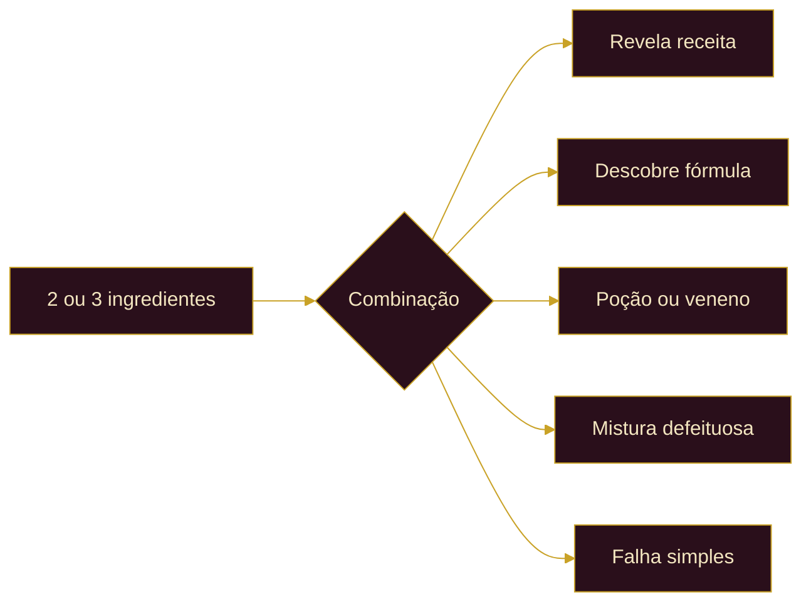

<div align="center">


<br>


<br>

Um módulo de alquimia para campanhas de **D&D 5e**, com receitas descobríveis,<br>
ingredientes, poções, venenos, progressão e ferramentas completas para jogadores e Mestres.

<br>

*"Toda grande descoberta começa com um ingrediente,<br>
uma hipótese e a coragem de misturá-los."*

<br>

[Recursos](#recursos) &nbsp;·&nbsp;
[Instalação](#instalação) &nbsp;·&nbsp;
[Como usar](#como-usar) &nbsp;·&nbsp;
[Experimentação](#experimentação) &nbsp;·&nbsp;
[Configurações](#configurações) &nbsp;·&nbsp;
[API pública](#api-pública) &nbsp;·&nbsp;
[Contribuindo](#contribuindo)

</div>

<p align="center"></p>

## Visão geral

O **Sistema de Alquimia** adiciona uma camada completa de criação e descoberta ao seu mundo de Foundry VTT. Personagens reúnem ingredientes, aprendem fórmulas, experimentam combinações e fabricam resultados, enquanto o Mestre controla o catálogo, o conhecimento individual e as regras da oficina.

A interface acompanha a atmosfera do módulo com três temas visuais:

| Tema | Ideal para |
| :--- | :--- |
| **Pergaminho** | Uma bancada clássica de estudos |
| **Escuro** | Laboratórios, masmorras e oficinas noturnas |
| **Claro** | Uma leitura mais limpa e luminosa |

<!-- IMAGEM DOS TEMAS: remova esta linha e a última para ativar
<p align="center">
  
  
  
</p>
-->

<!-- GIF DE APRESENTAÇÃO: remova esta linha e a última para ativar
<p align="center">
  
</p>
-->

<p align="center"></p>

## Recursos

<table>
<tr>
<td width="50%" valign="top">

### Para personagens

- Descoberta e conhecimento individual de receitas
- Biblioteca de poções, venenos e itens especiais
- Experimentação livre com **2 ou 3 ingredientes**
- Testes de alquimia por perícias, atributos ou fórmulas
- Consumo automático de ingredientes
- Restauração compensatória quando a tentativa não deve consumir reagentes
- Histórico de fabricação por personagem
- Favoritos e anotações privadas
- Progressão alquímica: XP, níveis e especializações
- Uso de poções, aplicação de venenos e efeitos integrados ao D&D 5e
- Integração opcional com **Midi-QOL**

</td>
<td width="50%" valign="top">

### Para Mestres

- Painel administrativo de alquimia
- Criação, edição, duplicação e exclusão de receitas
- Importação e exportação do catálogo
- Distribuição ou remoção de conhecimento dos personagens
- Controle de histórico, anotações e progressão
- Restauração das receitas de exemplo
- Logs administrativos
- Receitas secretas, descobríveis e requisitos de equipamento

</td>
</tr>
</table>

### Conteúdo incluído

| Elemento | Detalhe |
| :--- | :--- |
| Ingredientes alquímicos | **36** na biblioteca interna |
| Receitas padrão | **7** exemplos prontos |
| Catálogo expandido | **41** receitas |
| Tipos de resultado | Poção, veneno e especial |
| Idioma da interface | Português do Brasil |
| Temas | Pergaminho, escuro e claro |

Entre os ingredientes estão ervas, raízes, cogumelos, cristais, pós minerais, essências elementais, partes de criaturas, líquidos e reagentes estabilizadores.

### Compatibilidade

| Componente | Compatibilidade |
| :--- | :--- |
| Foundry Virtual Tabletop | v13 |
| Sistema D&D 5e | 4.0.0 ou superior, compatível com Foundry v13 |
| Midi-QOL | Opcional, usado para automação de itens e efeitos |

> O módulo funciona sem o Midi-QOL. Quando instalado, a integração fica disponível para os recursos compatíveis.

<p align="center"></p>

## Instalação

1. Baixe este repositório ou clone-o dentro da pasta de módulos do Foundry:

```
   FoundryData/Data/modules/alchemy-system
```

2. Confirme que o arquivo `module.json` está diretamente dentro da pasta `alchemy-system`.
3. Reinicie o Foundry VTT.
4. Abra um mundo baseado em **D&D 5e**.
5. Acesse **Configurações → Gerenciar Módulos**.
6. Ative o **Sistema de Alquimia**.

> **Atenção:** o identificador da pasta deve ser exatamente `alchemy-system`.

### Preparando os ingredientes

O macro [`macros/create-alchemy-ingredients.js`](macros/create-alchemy-ingredients.js) cria ou atualiza os 36 ingredientes alquímicos no mundo ou em um compêndio de itens.

1. Abra [`macros/create-alchemy-ingredients.js`](macros/create-alchemy-ingredients.js) e copie todo o conteúdo.
2. No Foundry, abra **Macros** e crie um macro do tipo **Script**.
3. Cole o conteúdo e configure as constantes no início:

```js
   const DESTINO = "compendium";
   const COMPENDIUM_COLLECTION = "";
   const QUANTIDADE_INICIAL = 3;
   const ATUALIZAR_EXISTENTES = true;
```

4. Execute o macro como Mestre.
5. Se `COMPENDIUM_COLLECTION` estiver vazio, selecione o compêndio na janela exibida.

<details>
<summary><b>Apontar para um compêndio específico</b></summary>

<br>

```js
const COMPENDIUM_COLLECTION = "world.alchemy-ingredients";
```

Substitua `world.alchemy-ingredients` pelo identificador do seu compêndio. Ele precisa ser um compêndio de **Itens** e estar desbloqueado para escrita.

</details>

<details>
<summary><b>O que o macro faz</b></summary>

<br>

- Cria ou atualiza os 36 ingredientes
- Evita duplicatas pelo nome
- Aplica a flag `alchemy-system.ingredient`
- Define a quantidade inicial
- Registra as propriedades alquímicas
- Informa no final quantos itens foram criados e atualizados

</details>

<!-- GIF DA INSTALAÇÃO DO MACRO: remova esta linha e a última para ativar
<p align="center">
  
</p>
-->

<p align="center"></p>

## Como usar

### Jogadores

A interface pode ser aberta de qualquer uma destas formas:

- Pelo botão de frasco na barra de chat
- Pelo botão de alquimia na ficha do personagem
- Selecionando um token vinculado a um personagem
- Pela API pública do módulo

Para fabricar uma receita, o personagem precisa ter:

- os ingredientes necessários, na quantidade exigida;
- conhecimento da receita, quando o conhecimento individual estiver ativo;
- o equipamento requerido, como **Kit de Alquimia**, quando essa opção estiver habilitada.

<!-- IMAGEM DA INTERFACE DO JOGADOR: remova esta linha e a última para ativar
<p align="center">
  
</p>
-->

### Mestres

O painel administrativo abre pelo controle de token ou pela API:

```js
game.modules.get("alchemy-system").api.openGM();
```

No painel, o Mestre administra receitas, ingredientes, conhecimento dos personagens, histórico, progressão, importação e exportação.

<!-- IMAGEM DO PAINEL DO MESTRE: remova esta linha e a última para ativar
<p align="center">
  
</p>
-->

<p align="center"></p>

## Experimentação

A experimentação permite selecionar exatamente **2 ou 3 ingredientes** e testar uma combinação.



Dependendo das configurações do mundo, uma combinação pode:

- revelar uma receita válida;
- descobrir automaticamente uma fórmula;
- produzir uma poção ou veneno;
- gerar uma mistura defeituosa;
- resultar em falha simples;
- executar um teste de alquimia com CD configurável.

> As combinações são revalidadas no momento da execução para evitar resultados inconsistentes com o inventário atual.

<!-- GIF DA EXPERIMENTAÇÃO: remova esta linha e a última para ativar
<p align="center">
  
</p>
-->

<p align="center"></p>

## Fabricação e itens do D&D 5e

As receitas mapeadas usam os itens reais do compêndio `dnd5e.items` como origem. Ao fabricar um item, o módulo preserva:

- descrição original;
- imagem;
- tipo e dados do item;
- efeitos e configurações do D&D 5e;
- identificação da origem em `flags.core.sourceId`.

A fabricação cria uma cópia mundial do documento do compêndio, seguindo o comportamento normal do Foundry VTT.

A receita de exemplo **Poção de Cura Superior** usa o seguinte UUID:

```
Compendium.dnd5e.items.Item.5m9ErO9In8Uc5yyf
```

> Se uma receita configurada por UUID ou aliases não encontrar o item correspondente, a fabricação é interrompida com uma mensagem clara, sem criar um item genérico silenciosamente.

<!-- GIF DA FABRICAÇÃO: remova esta linha e a última para ativar
<p align="center">
  
</p>
-->

<p align="center"></p>

## Configurações

<details>
<summary><b>Ver todas as configurações disponíveis</b></summary>

<br>

- Conhecimento individual por personagem
- Experimentação e descoberta automática
- Consumo de ingredientes em sucessos e falhas
- Testes, falhas, sucessos parciais e falhas críticas
- Exigência de equipamentos
- Identificação de ingredientes por nome
- Visibilidade das receitas desconhecidas
- Modo de falha para combinações inválidas
- Visibilidade dos cartões no chat
- Leitura de anotações pelo Mestre
- Limite do histórico por personagem
- Tema da interface
- Modo de depuração

</details>

## API pública

```js
// Abrir a interface do jogador
game.modules.get("alchemy-system").api.open();

// Abrir a interface do jogador para um ator específico
game.modules.get("alchemy-system").api.open(actor);

// Abrir o painel do Mestre
game.modules.get("alchemy-system").api.openGM();
```

A API também fica disponível globalmente como `AlchemyModule`.

## Atualização de receitas

O módulo mantém um `schemaVersion` para migrar receitas salvas no mundo. Após atualizar o módulo:

1. Entre no mundo como Mestre.
2. Aguarde o módulo concluir a inicialização.
3. Abra o painel administrativo.
4. Confirme se as receitas e seus mapeamentos foram atualizados.

Os novos aliases e UUIDs de compêndio são aplicados às receitas existentes durante a migração.

<p align="center"></p>

## Desenvolvimento

O projeto não possui processo de build nem dependências externas obrigatórias. Para validar a instalação local, execute na raiz do repositório:

```bash
node tools/validate.mjs
node tools/regression.mjs
```

<details>
<summary><b>O que a validação verifica</b></summary>

<br>

`tools/validate.mjs`:

- JSON do manifesto e das traduções
- Campos esperados no `module.json`
- Caminhos declarados no manifesto
- Sintaxe dos arquivos JavaScript
- Existência dos imports relativos
- Integridade das receitas de exemplo
- Correspondência dos ingredientes no inventário

</details>

<details>
<summary><b>O que a regressão verifica</b></summary>

<br>

`tools/regression.mjs`:

- As 7 receitas padrão
- As 41 receitas expandidas
- Receitas específicas, como invisibilidade e pele de pedra
- Propriedades da antitoxina concentrada
- Validação de todas as receitas
- Uso de 2 ou 3 ingredientes por receita

</details>

### Estrutura do projeto

```
alchemy-system/
├── assets/       # Ícones SVG e imagens do módulo
├── lang/         # Traduções, atualmente pt-BR
├── macros/       # Macros para criação e manutenção de ingredientes
├── scripts/      # API, dados, fabricação, inventário e integração
├── styles/       # Temas e estilos da interface
├── templates/    # Templates Handlebars das interfaces
├── tools/        # Validação e testes de regressão
├── LICENSE       # Licença MIT
├── module.json   # Manifesto do módulo
└── README.md     # Este documento
```

<p align="center"></p>

## Contribuindo

Contribuições são bem-vindas. Antes de abrir um pull request:

1. Descreva claramente o problema ou a melhoria.
2. Mantenha a interface e as traduções consistentes.
3. Execute os scripts de validação e regressão.
4. Informe no pull request quais testes foram executados.
5. Evite alterar receitas existentes sem documentar a mudança.

Para relatar um problema, abra uma [issue](https://github.com/Larycronx/alchemy-system/issues) com:

- versão do Foundry VTT;
- versão do D&D 5e;
- versão do módulo;
- módulos adicionais ativos;
- passos para reproduzir o problema;
- mensagens relevantes do console, se houver.

## Licença

Distribuído sob a [licença MIT](LICENSE).

<p align="center"></p>

<div align="center">

[Repositório](https://github.com/Larycronx/alchemy-system) &nbsp;·&nbsp;
[Foundry VTT](https://foundryvtt.com/) &nbsp;·&nbsp;
[Sistema D&D 5e](https://foundryvtt.com/packages/dnd5e/) &nbsp;·&nbsp;
[Issues e sugestões](https://github.com/Larycronx/alchemy-system/issues)

<br>

*Forjado para campanhas de fantasia, descobertas perigosas<br>
e poções que talvez não devessem ser tomadas.*

</div>
